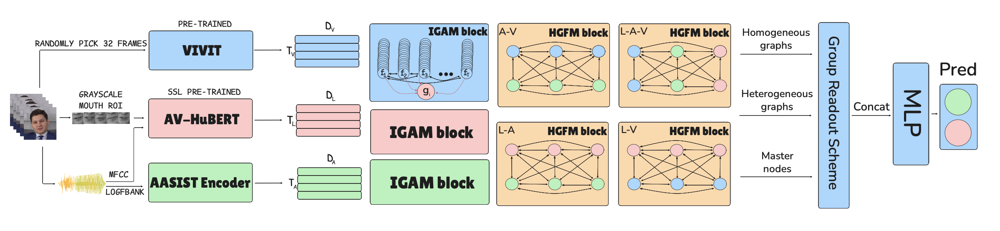

# Multimodal system for audio-visual deepfake detection

We combine AV-HuBERT, ViViT and AASIST encoder to extract audio-visual features, which are then processed by a graph-based classifier to achieve higher results in audio-visual deepfake detection. See the [paper](https://github.com/runtime57/deepfake_detection/blob/main/paper/Multimodal%20System%20for%20Audio-Visual%20Deepfake%20Detection.pdf) for details.



## Installation

0. Create and install [`conda`](https://conda.io/projects/conda/en/latest/user-guide/getting-started.html) environment

    ```
    conda create -n deepfake_detection python=3.8 -y
    conda activate deepfake_detection
    ```

1. Clone this repository

    ```
    git clone git@github.com:runtime57/deepfake_detection.git
    cd deepfake_detection

    git submodule init
    git submodule update
    ```

    You may need to set `DBG` variable to `False` by hand in AV-HuBERT files.

2. Install all required packages
    ```
    pip install -r requirements.txt
    ```
3. Install pre-commit
    ```
    pre-commit install
    ```

## Results


| Method               | Class | Prec | Rec  | F1   | Acc  | Visual changes | Audio changes |
|----------------------|-------|------|------|------|------|----------------|----------------|
| **FaceSwap**         | Real  | 0.53 | 0.97 | 0.69 | 0.57 | ✅             |                |
|                      | Fake  | 0.83 | 0.14 | 0.24 |      |                |                |
| **FSGAN**            | Real  | 0.59 | 0.96 | 0.72 | 0.65 | ✅             |                |
|                      | Fake  | 0.88 | 0.31 | 0.46 |      |                |                |
| **Wav2Lip**          | Real  | 0.76 | 0.97 | 0.85 | 0.84 |                | ✅             |
|                      | Fake  | 0.96 | 0.70 | 0.81 |      |                |                |
| **RTVC**             | Real  | 1.00 | 0.96 | 0.98 | **0.98** |                | ✅             |
|                      | Fake  | 0.96 | 1.00 | 0.98 |      |                |                |
| **FaceSwap+Wav2Lip** | Real  | 0.94 | 0.97 | 0.96 | **0.96** | ✅             | ✅             |
|                      | Fake  | 0.97 | 0.94 | 0.96 |      |                |                |
| **FSGAN+Wav2Lip**    | Real  | 0.76 | 0.97 | 0.86 | 0.84 | ✅             | ✅             |
|                      | Fake  | 0.96 | 0.70 | 0.81 |      |                |                |
| **Test-set-1**       | Real  | 0.76 | 0.96 | 0.85 | 0.82 | ✅             | ✅             |
|                      | Fake  | 0.94 | 0.68 | 0.79 |      |                |                |
| **Test-set-2**       | Real  | 0.83 | 0.97 | 0.89 | 0.89 | ✅             | ✅             |
|                      | Fake  | 0.96 | 0.80 | 0.87 |      |                |                |


Due to limited computational resources, we did not fine-tune AV-HuBERT and ViViT, which negatively affects the overall performance of the system. Nevertheless, our approach still achieves results that are close to the state of the art on multiple test sets.

## Train and inference
 

To train a new model, use the following command:
```
python3 train.py -cn=CONFIG_NAME HYDRA_CONFIG_ARGUMENTS
```
Where `CONFIG_NAME` is a config from `src/configs/model` and `HYDRA_CONFIG_ARGUMENTS` are optional arguments

To run inference (evaluate the model or save predictions):
```
python3 inference.py -cn=CONFIG_NAME
```

